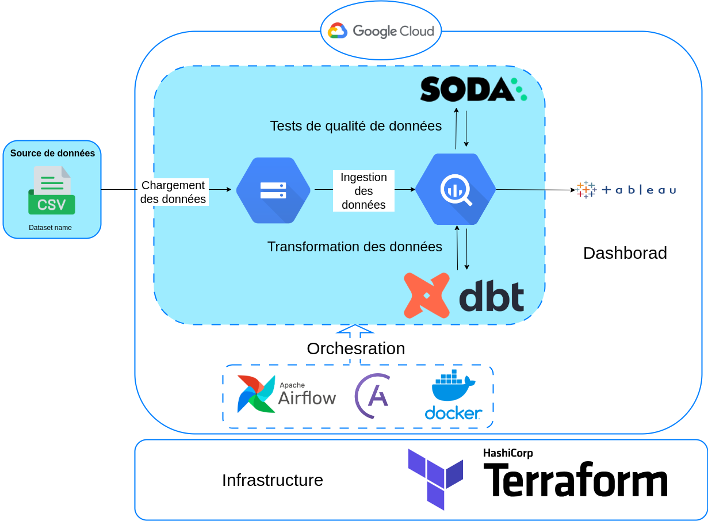
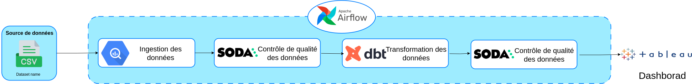
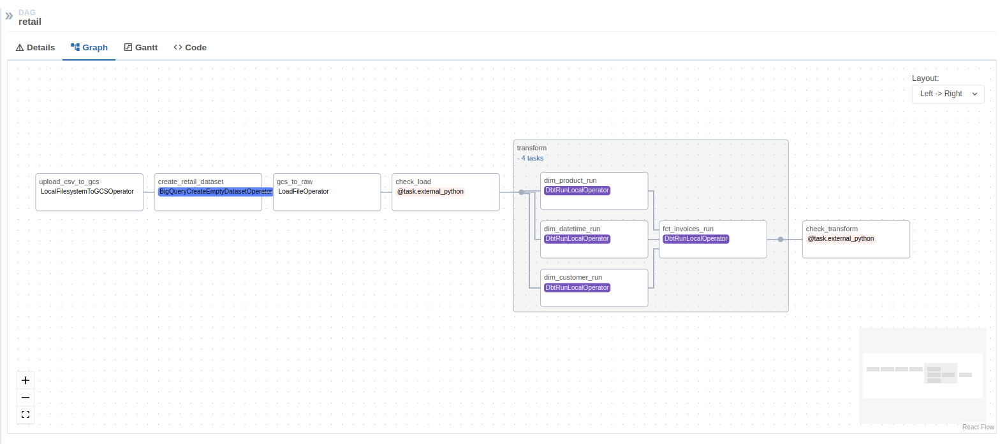
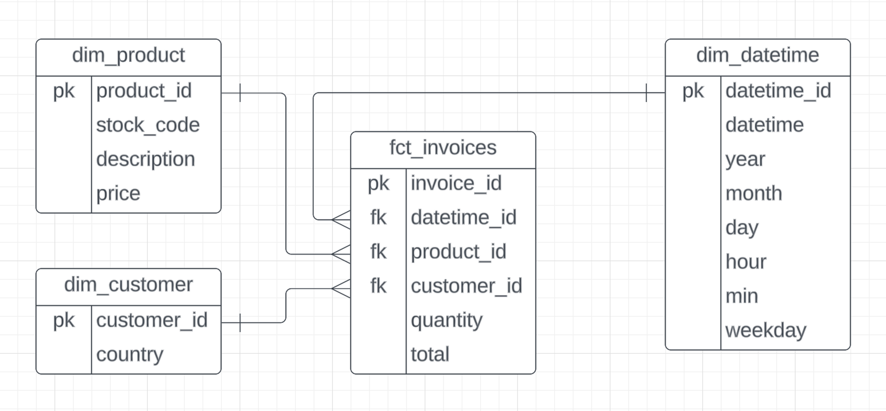

# Trend Sales Detection

## project description
A data engineering project in which we'll be creating an ETL data pipeline to extract, analyze and visualize information from the data of an online retail company.

For the ML model, this is a website developed with Dash and Python, under the name FashionMe, where you can consult the list of the most popular, most expensive and least expensive products. It also incorporates an additional database containing images associated with the products.

## Dataset
Data on online retail transactions.

| **Column** | **Description** |
| :--------------- |:---------------| 
| **InvoiceNo** |  Invoice number. Nominal, a 6-digit integral number uniquely assigned to each transaction. If this code starts with the letter 'c', it indicates a cancellation.  |  
| **StockCode** | Product (item) code. Nominal, a 5-digit integral number uniquely assigned to each distinct product. |
| **Description**   |  Product (item) name. Nominal.  |
| **Quantity**   |  The quantities of each product (item) per transaction. Numeric.  |
| **InvoiceDate**   |  Invoice Date and time. Numeric, the day and time when each transaction was generated.  |
| **UnitPrice**   |  Unit price. Numeric, Product price per unit in sterling.  |
| **CustomerID**   |  Customer number. Nominal, a 5-digit integral number uniquely assigned to each customer.  |
| **Country**   |  Country name. Nominal, the name of the country where each customer resides.   |

## Project Architecture

- Configure google cloud infrastructure using Terraform.
- Configure the local Airflow environment with Astro CLI.
- Create a data pipeline using Airflow.
- Upload CSV files to Google Cloud Storage.
- Manage data in BigQuery.
- Implement data quality checks in the pipeline using - Soda.
- Integrate dbt and cosmos to run data models with Airflow.
- Create a dashboard using Tableau.
- Train ML model with BigQueryML.



### Pipeline Architecture


### Pipeline sur airflow (Pipeline on Airflow)


### Data Modeling (dimention tables)


### Technologies Used
- **Infrastructure**: Terraform
- **Google Cloud Platform (GCP)**
  - Data Lake : Cloud Storage
  - Data Warehouse : BigQuery
- **Astro SDK** for Airflow setup
- **Workflow orchestration:** Apache Airflow
- **Transforming data:** dbt & cosmos
- **Data quality checks:** Soda
- **Containerization:** Docker
- **Data Visualization:** Tableau
- **Machine Learning:** BigQueryML

## Usage
#### 1. Clone repository:
First, clone the repository using http:
```
git clone https://github.com/Youcef-Abdelliche/trend-sales-detection.git
```
or ssh:
```
git clone git@github.com:Youcef-Abdelliche/trend-sales-detection.git
```

#### 2. Setup GCP configuration (Google cloud platform):

1. Create your GCP free trial.
2. Set up new project and write down your Project ID.
3. Configure service account to get access to this project and download auth-key (.json). Please check the service account has all the permissions below:
    - Viewer
    - Storage Admin
    - Storage Object Admin
    - BigQuery Admin
4. Download auth-key json file and replace it with service-account.json file in the path:
```
include/gcp/service-account.json
```
4. Download SDK for local setup.

5. Enable the following options under the APIs and services section:
  - Identity and Access Management (IAM) API
  - IAM service account credentials API

#### 3. Terraform

#### 4. Airflow Pipeline
1. Start Airflow on your local machine by running:
```
astro dev start
```
This command will start 4 Docker containers on your machine, each for a different Airflow component:

- **Webserver:** The Airflow component responsible for rendering the Airflow UI
- **Scheduler:** The Airflow component responsible for monitoring and triggering tasks
- **Triggerer:** The Airflow component responsible for triggering deferred tasks
- **Postgres:** Airflow's Metadata Database

Run 'docker ps' to verify that all 4 Docker containers were created.
```
docker ps
```

2. Access the Airflow UI for your local Airflow project. To do so, go to 
```
http://localhost:8080/
```
and log in with those crededntials: 
Username: 'admin'
Password: 'admin'

4. Configure your Google Cloud Platform credentials.
5. Create and configure the necessary connections in Airflow:
In the Airflow UI:
- Airflow → Admin → Connections
    - id: gcp
    - type: Google Cloud
    - Keypath Path: `/usr/local/airflow/include/gcp/service_account.json`
- Test the connection (Click on 'Test' button) → Save (Click on 'Save' button)
6. Customize the Airflow DAGs to suit your specific requirements.
7. Run the pipeline and monitor its execution.

#### 5. Tableau visualization


