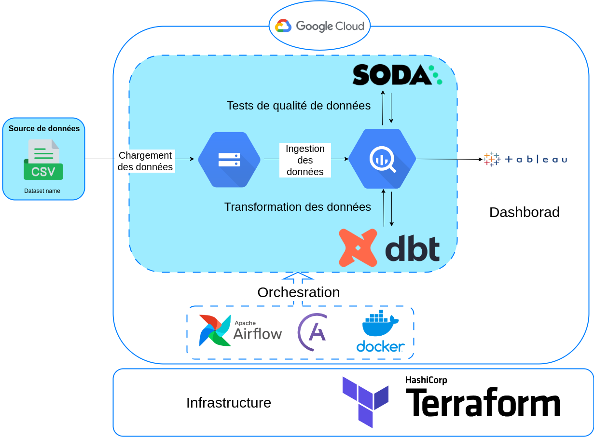

# Trend Sales Detection

## Description du projet
Un projet de Data engineering dans lequel nous allons créer un pipeline de données ETL pour extraire, analyser et visualiser des informations à partir des données d'une entreprise de vente au détail en ligne.

Pour le modèle ML, c'est un site web développé avec Dash et Python, sous le nom de FashionMe, où l'on peut consulter la liste des produits les plus populaires, les plus chers et les moins chers. Il intègre également une base de données supplémentaire contenant des images associées aux produits.

## Jeu de données (Dataset)
Ensemble de données sur les transactions de vente au détail en ligne.

| Colonne | Description |
| ------ | ------ |
| ID de transaction | Numéro de facture. Nominal, un numéro intégral à 6 chiffres attribué de manière unique à chaque transaction. Si ce code commence par la lettre "c", il s'agit d'une annulation. |
|Date de la transaction|Date et heure de la facture. Numérique, le jour et l'heure où chaque transaction a été générée.|
|Code produit|Code produit (article). Nominal, un numéro intégral à 5 chiffres attribué de manière unique à chaque produit distinct.|
|Description du produit|Nom du produit (article). Nominal.|
|Quantité vendue|La quantité de chaque produit (article) par transaction. Numérique.|
|Prix unitaire|Prix unitaire. Numérique, prix du produit par unité en livres sterling.|
|Pays|Nom du pays. Nominal, le nom du pays où réside chaque client.|

## Architecture du projet

- Configurer l'infrastructure du google cloud à l'aide de Terraform.
- Configurer l'environnement local Airflow avec Astro CLI.
- Créer un pipeline de données en utilisant Airflow.
- Télécharger les fichiers CSV dans Google Cloud Storage.
- Ingestion des données dans BigQuery.
- Implémenter des contrôles de qualité des données dans le pipeline en utilisant - Soda.
- Intégrer dbt et exécuter des modèles de données avec Airflow.
- Créer un dashboard en utilisant Tableau.

